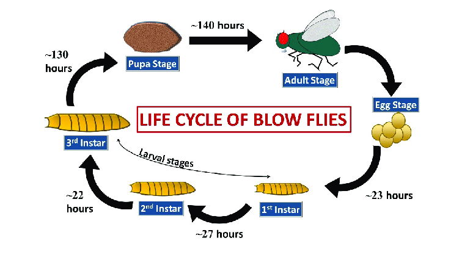
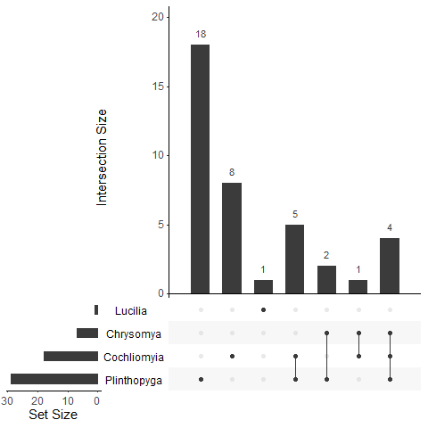
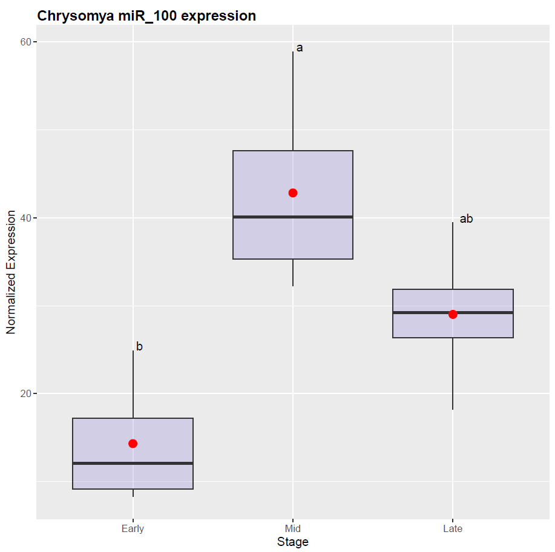
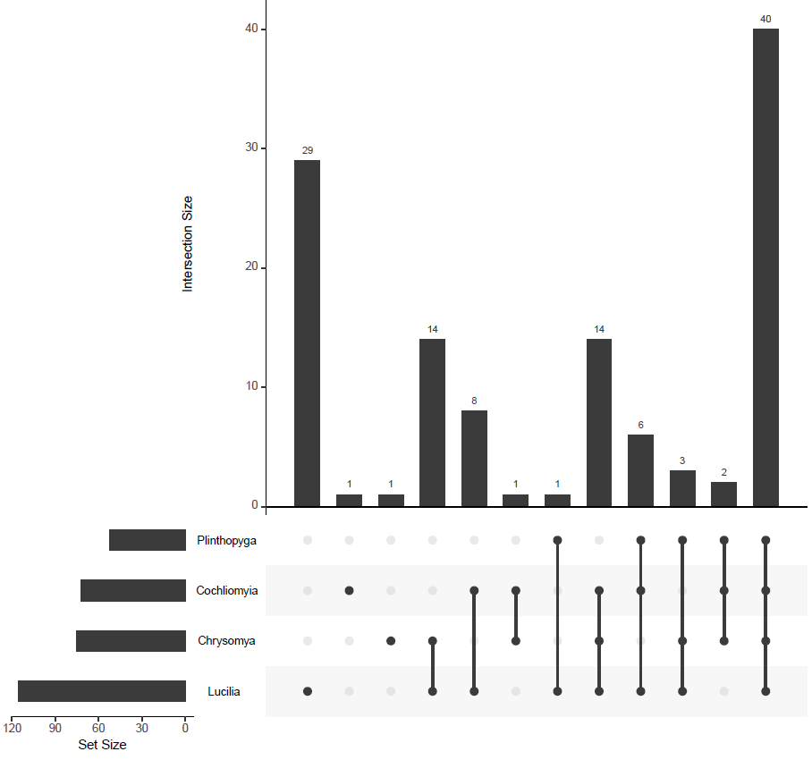
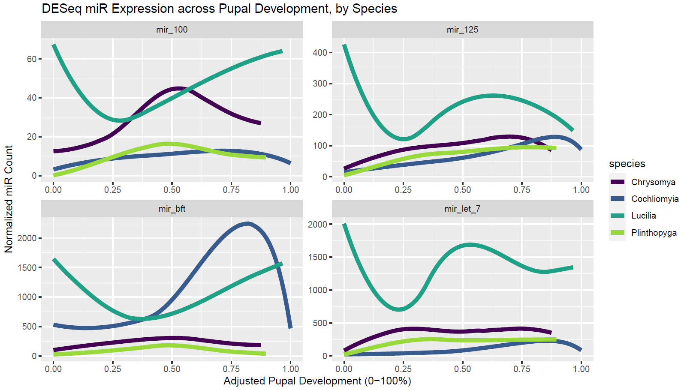
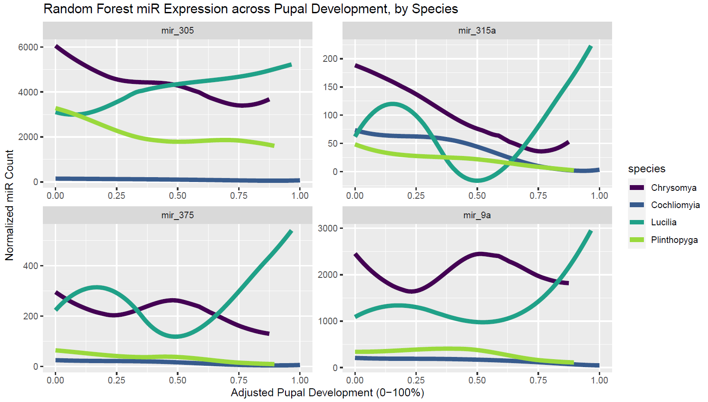

```{r setup, include=FALSE}
knitr::opts_chunk$set(echo = TRUE)
```

## Using microRNAs to Predict Forensic Flies' Age

## Preface

Please note: this project's data is **NOT** published yet; please don't share these results outside of our class. I don't want to get turned into fly food.  
This also means that none of the code here will be able to run, as none of the data files are stored online. I pinky promise that the graphs shown below were generated using my code.


## Fly Forensics

Boy howdy, do some flies love to eat meat--especially when their meal is too dead to swat them away. Sometimes, that meat is people!

Forensic scientists often use blow flies to estimate the time since a cadaver's death. Because blow flies arrive within hours of death, their development is directly linked with the cadaver's. The blow fly life cycle has 4 visually distinct stages: egg, larva (split into 3 instars), pupa, and adult.  
```{r, echo=FALSE, out.width="110%", out.height="110%", fig.align='center'}

```

*Image source: https://doi.org/10.18099/ijetv.v7i01.5*

About half of an immature fly's life is spent as a **pupa**. Unfortunately for forensic scientists, a newly-shelled pupa looks the same as a nearly-hatching pupa. This leaves a week of uncertainty in the time of death estimate-- far too long to confidently base a court case on. That's where Dr. Hjelmen's & my research comes in!


## Previous Research

Dr. Hjelmen has already worked with a number of researchers to find genetic markers of age in the blow fly *Cochliomyia macellaria*. They specifically focused on micro-RNAs (**miRs**), as these genetic molecules are present in different amounts at different times of development, yet they're more stable than the more commonly analyzed messenger-RNAs.

Dr. Hjelmen's team validated two significantly differentially expressed (i.e. potentially forensically useful) miRs in *C. macellaria*: bantam and miR-92b.  
Check out their original publication [**here**](https://cehjelmen.github.io/assets/publications/insects_2022_miRNA_macellaria.pdf)!

After their publication, they continued to sequence miRs from *C. macellaria* (hereafter called **Cochliomyia**), and they began sequencing miRs from 3 more forensic blow fly species: *Chrysomya rufifacies* (**Chrysomya**), *Lucilia cuprina* (**Lucilia**), and *Blaesoxipha plinthopyga* (**Plinthopyga**).

My role in Dr. Hjelmen's lab is to identify miRs that may be good predictors of fly pupa age across species, especially miRs that aren't affected by variables like the fly's sex or environment's temperature.  
My role in Dr. Geoffrey Zahn's class is to generate the simplest yet most accurate age model possible, to demonstrate my understanding of BIOL3100: Data Analytics. Ideally, this model will also lay the groundwork for making future forensic scientists' jobs easier... or at least have less guesswork.


## Step 0: Count Consolidation

The raw data I received consisted of many CSV files of raw miR sequence counts organized by miR name, fly sample, and pupa development time. The names were obtained via BLAST alignment of each read, so many of the same sequences were identified with slightly different name codes--depending on with species the read first aligned with.  
As such, my first task was to consolidate the miR names, adding together the counts from the same sequences. Because I joined this project before I learned enough R, I wrote the consolidation code in Python. Click [**here**](https://sarahef13.github.io/fly_miR_analysis_code/count_consolidator.py) to download the .py file!


## Step 1: DESeq

Once the miR counts were collected under the right names, they had to be normalized to account for rtPCR variability. That is to say, we needed the data to be consistently scaled for the numbers to mean anything when compared to one another. Once the data was normalized, we could analyze how the counts changed across pupa development stages. miRs that changed significantly over time may be good markers of age!

To normalize and analyze the counts, I used `library(DESeq2)` and made a function called `DESeeker`. DESeq stands for Differentially Expressed Sequences. This library is specially designed to compare RNA/DNA changes over time based on their log fold changes, and it reports their significance using adjusted p values. As it was my first formal R function, `DESeeker` is lacking the many shortcuts and improvements I've learned during this class.

Each CSV file input to `DESeeker` resulted in:  

* *file_resOrdered.csv*, all DESeq results in order of adjusted p value  
* *file_sig.csv*, only DESeq results with low adjusted p & high log fold change  
* *file_normalized.csv*, normalized versions of all counts

Click [**here**](https://sarahef13.github.io/fly_miR_analysis_code/deseq_seeker.R) to download the full DESeq code file, or click the Show button to see a code preview.

<button class="btn btn-primary" data-toggle="collapse" data-target="#rCode1">Show/Hide DESeeker Preview</button>
<div id="rCode1" class="collapse">
```{r message=FALSE, class.source='fold-hide'}

DESeeker <- function(csvFile) {
  
  # Getting Data From File
  countData <- read.csv(csvFile, header=T, row.names=1)
  column_names <- gsub('\\.\\d+$', '', names(countData))
  
  # Running DESeq On Data
  colData <- DataFrame(condition=factor(column_names))
  dds <- DESeqDataSetFromMatrix(countData, colData, formula(~ condition))
  dds <- DESeq(dds)
  
  res <- results(dds)
  resOrdered <- res[order(res$padj),]
  head(resOrdered)
  sig <- resOrdered[!is.na(resOrdered$padj) & resOrdered$padj<0.10 & abs(resOrdered$log2FoldChange)>=1,]
  head(sig)
  selected <- rownames(sig)
  
  # Saving Results To CSVs
  resOrdered_name <- gsub('\\.csv', '_resOrdered.csv', csvFile)
  write.csv(resOrdered, resOrdered_name)
  
  sig_name <- gsub('\\.csv', '_sig.csv', csvFile)
  write.csv(sig, sig_name)
  
  normalized_name<- gsub('\\.csv', '_normalized.csv', csvFile)
  write.csv(counts(dds,normalized=TRUE), normalized_name)
}
```
</div>

## Step 2: Upset Plots

Once I got the CSV files of significant miRs from `DESeeker`, I used `library(UpSetR)` and `library(tidyverse)` to generate upset plots, which compare the contents of each file. Upset plots are a vastly superior alternative to Venn diagrams when you have more than 2 sets to compare. For this project, I had 4-9 files of miR names to find overlaps between; upset plots were a *must*.

To make the plots, I wrote 3 functions to pull miR names from the CSVs and feed them to `UpSetR::upset()`. Click [**here**](https://sarahef13.github.io/fly_miR_analysis_code/upset_plot_sigs.R) to download the full upset plot code file, or click the Show button to see a code preview.

<button class="btn btn-primary" data-toggle="collapse" data-target="#rCode2">Show/Hide Upset Plotter Preview</button>
<div id="rCode2" class="collapse">
```{r message=FALSE, class.source='fold-hide', eval=FALSE}

# Functions that set up data for upset()

name_adder <- function(filename) {
  species <- gsub('\\_py_consol_sig.csv', '', filename)
  sig_full <- read_csv(filename)
  colnames(sig_full)[1] <- 'miR'
  sig_names <- sig_full$miR
  return(sig_names)
}

get_names <- function(filename) {
  species <- gsub('\\_py_consol_sig.csv', '', filename)
  return (species)
}

name_compiler <- function(infile) {
  files_to_analyze <- list.files(pattern = infile, recursive = TRUE)
  sig_names <- lapply(files_to_analyze, name_adder)
  file_names <- lapply(files_to_analyze, get_names)
  names_together <- setNames(sig_names, file_names)
  return(names_together)
}


# Making an upset plot

chry_names_together <- name_compiler('chry_.*?py_consol_sig.csv')
coch_names_together <- name_compiler('coch_.*?py_consol_sig.csv')
luci_names_together <- name_compiler('luci.*?py_consol_sig.csv')
plin_names_together <- name_compiler('plin.*?py_consol_sig.csv')

wt_names_together <- list("Chrysomya" = chry_names_together[[2]], 
                             "Cochliomyia" = coch_names_together[[1]],
                             "Lucilia" = luci_names_together[[3]],
                             "Plinthopyga" = plin_names_together[[2]])

upset(fromList(wt_names_together), nsets=length(wt_names_together))

```
</div>
</br>
As you can see below, no miR was significantly differentially expressed in all four species, but 4 miRs were in three of the species. Those 4 are **let-7**, **bft**, **miR-100**, and **miR-125**.  **miR-315a** was found in Chrysomya & Cochliomya, which are more related than the other species.
```{r, echo=FALSE, out.width="60%", out.height="60%", fig.align='center'}

```

## Step 3: Tukey Boxplots

Once I had some significant cross-species miRs to look into, I had to verify that their counts were differential across pupa stages. I used `library(multcompView)` and `library(ggplot2)` to generate Tukey boxplots for each miR in each species. Click [**here**](https://sarahef13.github.io/fly_miR_analysis_code/tukey_boxplotter.R) to download the full Tukey plot code file, or click the Show button to see a code preview.

<button class="btn btn-primary" data-toggle="collapse" data-target="#rCode3">Show/Hide Tukey Plotter Preview</button>
<div id="rCode3" class="collapse">
```{r message=FALSE, class.source='fold-hide', eval=FALSE}

# process _py_consol_normalized.csv files to be usable for Tukey:
norm_data_cleaner <- function(filename, signames) {
  # filename should be a complete, unique path string
  # signames should be a chr vector of miR to analyze
  normdata <- read_csv(filename)
  normdata <- normdata %>% 
    rename(miR = 1) %>% 
    filter(miR %in% signames) %>% 
    mutate(miR = paste0('miR_', miR)) %>% 
    t() %>%
    as.data.frame() %>% 
    row_to_names(1) %>% 
    rownames_to_column(var = 'stage') %>% 
    mutate(stage = gsub('\\.\\d+$', '', stage))
  ordlevels <- unique(normdata$stage)
  normdata <- normdata %>%
    mutate(stage = factor(stage, levels=ordlevels, ordered=TRUE)) %>% 
    mutate_if(is.character, as.numeric)
  return(normdata)
}


# Extract labels and factor levels from Tukey post-hoc 
generate_label_df <- function(TUKEY, variable) {
  Tukey.levels <- TUKEY[[variable]][,4]
  Tukey.labels <- data.frame(multcompLetters(Tukey.levels)['Letters'])
  Tukey.labels$treatment=rownames(Tukey.labels)
  Tukey.labels=Tukey.labels[order(Tukey.labels$treatment) , ]
  return(Tukey.labels)
}


# Calls the above functionss for 1 Tukey calculation
single_mir_analyzer <- function(mircol, indf) {
  # indf is a cleaned df of normalized mir data
  # mircol is the column of the cleaned data to analyze
  model1 = lm(indf[[mircol]] ~ indf$stage)
  ANOVA1 = aov(model1)
  
  model1=lm(indf[[mircol]] ~ indf$stage)
  ANOVA1=aov(model1)
  
  TUKEY <- TukeyHSD(x=ANOVA1, 'indf$stage', conf.level=0.95) # Tukey test to study each pair of treatment
  labels <- generate_label_df(TUKEY, 'indf$stage') # generate labels using function
  names(labels) <- c('Letters','stage') #rename columns for merging
  yvalue <- aggregate(.~stage, data=indf, max) # obtain letter position for y axis using means
  final1 <- merge(labels, yvalue) # merge dataframes
  return(final1)
}


# Generate one Tukey boxplot for one miR in one species
single_mir_grapher <- function(mircol, final1, prefinal, speciesname) {
  col_to_graph <- colnames(final1)[mircol]
  tukey_plot <- ggplot(prefinal, aes(x = stage, y = !!sym(col_to_graph))) +
    geom_boxplot(fill = 'slateblue', alpha=0.2, stat = "boxplot") +
    labs(x = 'Stage', y = 'Normalized Expression') +
    ggtitle(paste0(speciesname, " ", colnames(final1)[mircol], " expression"))+
    theme(plot.title = element_text(face='bold')) +
    geom_text(data = final1, aes(x = stage, y = !!sym(col_to_graph)+0.5, label = Letters), hjust=-0.5) +
    stat_summary(fun=mean, geom="point", shape=20, size=5, color="red", fill="red") +
    theme(plot.title = element_text(vjust=-0.6))
  return(tukey_plot)
}


# Get & clean the data, specify what miRs to analyze, and generate the Tukey plots in a PDF

infile <- list.files(pattern = 'chry_allrufcounts_py_consol_normalized.csv', recursive = TRUE)
innames <- c("let-7", "125", "100", "bft", "315a")
outdf <- norm_data_cleaner(infile, innames)
species <- "Chrysomya"

pdf(gsub('\\.csv', '_tukey.pdf', infile))
for (i in 2:length(outdf)) {
  analysis <- single_mir_analyzer(i, outdf)
  graph <- single_mir_grapher(i+1, analysis, outdf, species)
  plot(graph)
}
dev.off()

```
</div>
</br>
Tukey analyses on the data's boxplots added letters to show how distinct each grouping (pupa stage) was from the others. In the example plot below, miR 100 in Chrysomya was able to distinguish between Early (**b**) and Middle (**a**) pupa growth. However, Late growth expression was spread across (indistinguishable from) the Early & Middle values, so it was marked with both stages' letters: **ab**.  
```{r, echo=FALSE, out.width="80%", out.height="80%", fig.align='center'}

```

Overall, the results for let-7, bft, miR-100, miR-125, & miR-315a across high-quality data for Chrysomya, Cochliomya, and Plinthopyga are as follows:

- Chrysomya
  - No significant differences between any stage for any miR except 315a (early)
  - The example plot above with miR 100 was generated from low-quality data
- Cochliomyia
  - No differences in miR 100
  - let-7, 125, & bft separated early_pup vs mid_pup_2
  - 315a separated 1st vs 2nd half
- Plinthopyga
  - miR 100 & 125 separated all stages
  - bft separated mid stage
  - let-7 separated early stage
  
Note: Lucilia was left out of this list because it had no significant miRs that overlapped with the other species.


## Step 4: Random Forests

`DESeeker` was one way of determining which miRs may be good predictors of pupa development, but there are others! Random Forest (**RF**) analysis is a low-level AI approach to predictive modeling. During RF, the computer randomly generates 500 decision trees, then uses those to find the best overall path from miR count to pupa development %. Each tree is made of a series of decision branches; for example, "If miR-100 has >=50 counts, then the pupa is >75% developed. Otherwise, the pupa is <=75% developed."

Because RF is random, no two analyses will return the exact same model. Therefore, I ran RF 100 times on each species' data and compiled a list of each result's top 25 predictive miRs. Although there is a `randomForest` package, I used the newer, faster `library(ranger)` to run the RF, and I used `library(vip)` to extract the top miR names. I made more upset plots to find which top miRs were found in all species' results.

Click [**here**](https://sarahef13.github.io/fly_miR_analysis_code/randomforest_modeler.R) to download the full Random Forest code file, or click the Show button to see a code preview.

<button class="btn btn-primary" data-toggle="collapse" data-target="#rCode4">Show/Hide RF Modeler Preview</button>
<div id="rCode4" class="collapse">
```{r message=FALSE, class.source='fold-hide', eval=FALSE}

get_devel_data <- function() {
  # This function imports fly development % data and formats it for use with miR count data
  
  # This file lists the % development of each fly sample at each pupal stage
  devel_file <- list.files(pattern = 'sample_percent_development_by_species.csv', recursive = TRUE)
  devel_data <- read_csv(devel_file)
  
  # make the names match the data folders
  devel_data <- devel_data %>% 
    clean_names() %>% 
    rename(Cochliomyia = c_macellaria) %>% 
    rename(Chrysomya = c_rufifacies) %>% 
    rename(Lucilia = l_cuprina) %>% 
    rename(Plinthopyga = b_plinthopyga)
  
  # convert chr % values to NAs/decimals, as appropriate
  devel_data <- devel_data %>% 
    mutate(across(-stage, ~na_if(., "-"))) %>% 
    mutate(across(-stage, ~gsub("%", "", .))) %>% 
    mutate(across(-stage, ~as.numeric(.))) %>% 
    mutate(across(-stage, ~./100))
}


norm_data_cleaner <- function(){
  #the full .R file has the rest of the cleaning code
  
  # adjust lifetime development % to puparial development %
  min_devel = min(normdata$development)
  normdata <- normdata %>% 
    mutate(adjusted_devel = (development - min_devel)/(1 - min_devel))
  
  return(normdata)
}


forest_grower <- function(dataframe, species_name, devel=NULL) {
  # grows a random forest that models species_name's % development
  # dataframe must have been through norm_data_cleaner() to work here
  # devel is optional; if 'adjusted', analysis will use adjusted_devel

  devel_mod <- 
    dataframe %>% 
    filter(species == species_name) %>% 
    select_if(~ !any(is.na(.))) # eliminate columns with NAs
  
  # p represents the number of independent variables that the trees can branch on
  p <- devel_mod %>% 
    select(starts_with('mir_')) %>% 
    ncol()

  if (is.null(devel)) {
    devel_mod <- devel_mod %>% 
      select(-c(stage, species, adjusted_devel)) %>% 
      ranger(formula = development ~ ., 
             importance = 'permutation', # we're modeling regression, not classification
             min.node.size = 4, # fits our sample groupings better than default 5
             mtry = floor(p/3), # recommended m for regression is p/3, not default p^0.5
             scale.permutation.importance = TRUE) # seemed like a good idea?
  } else if (devel == 'adjusted') {
    devel_mod <- devel_mod %>% 
      select(-c(stage, species, development)) %>% 
      ranger(formula = adjusted_devel ~ ., 
             importance = 'permutation', 
             min.node.size = 4,
             mtry = floor(p/3),
             scale.permutation.importance = TRUE)
  }

  return(devel_mod)
}


devel_df <- get_devel_data()

# make a data frame from each species' file and collect the frames in a list
df_list <- 
  wt_filepaths %>% 
  map(norm_data_cleaner)
names(df_list) <- species_names

# make that list of individual data frames into one big frame
alldat <- reduce(df_list, full_join)


# getting a bunch of randomForest results in one big table
vip_mirs <- list()
vip_mir_counts <- list()

for(species in species_names){
  vip_mirs[[species]] <- list()
  
  # run randomForest a bunch of times, grabbing the top 25 miRs each time
  for(i in 1:100){
    forest <- forest_grower(alldat, species_name=species, devel='adjusted')
    vip_mirs[[species]][[i]] <- 
      vi(forest)[['Variable']] %>% 
      head(25)
  }
  
  # consolidate the top miR results into a frequency table
  vip_mir_counts[[species]] <- 
    vip_mirs[[species]] %>% 
    unlist() %>% 
    table() %>% 
    data.frame() %>% 
    clean_names() %>% 
    rename(mir = x) %>% 
    mutate(species = species) %>% 
    arrange(desc(freq))
}


# combine randomForest results from all species into one table
vip_mir_allcounts <- 
  reduce(vip_mir_counts, full_join)

# sum how many times each miR is among the top variables across all species
total_mir_counts <- 
  vip_mir_allcounts %>% 
    group_by(mir) %>% 
    summarise(total_freq = sum(freq)) %>% 
    arrange(desc(total_freq))

# make the total miR sums a new column in the table of individual counts
vip_mir_allcounts <- 
  vip_mir_allcounts %>% 
    full_join(total_mir_counts) %>% 
  arrange(desc(total_freq))


# visualize how many miRs appeared in each grouping of species
# then print the miRs that appeared in all species AND in at least 300/400 forests
forest_name_results <- list()
for (species in species_names){
  forest_name_results[[species]] <- as.character(vip_mir_counts[[species]][["mir"]])
}

pdf(paste0(getwd(), '/randomforest_adj_devel_upset.pdf'))
forest_upset <- upset(fromList(forest_name_results), nsets=length(forest_name_results))
forest_upset
dev.off()

upset_all_species <- reduce(forest_name_results, intersect)
frequent_mirs <- 
  total_mir_counts %>% 
  filter(total_freq >= 300) %>% 
  pull(mir)
freq_upset_adj_devel_mirs <- intersect(upset_all_species, frequent_mirs)

```
</div>
</br>
I should note that the original development % data was scaled by the % of the flies' entire life, but we found it more helpful to scale it by the % of the flies' time as a pupa. This re-scaling is what the description "**adjusted**" refers to.

*RF Upset Plot Results*

- With normal devel % data:
  - 37 miRs found in top 25 vars of all 4 species
  - Of those, 4 miRs were in 300/400 forests: **315a**, **375**, **305**, & **9a**
- With adjusted devel % data:
  - 40 miRs found in top 25 vars of all 4 species
  - Of those, 2 miRs were in 300/400 forests: 315a, 375
- Note: seed not reset for adjusted analysis

```{r, echo=FALSE, out.width="80%", out.height="80%", fig.align='center'}

```

Surprisingly, `DESeeker` didn't identify any of the miRs that RF did except 315a, which it only found significant in Chrysomya & Cochliomya-- not in all four species like RF did. 


## Step 5: Tukey II

The first round of Tukey plots was generated from let-7, bft, miR-100, miR-125, & miR-315a for Chrysomya, Cochliomya, and Plinthopyga-- as suggested by `DESeeker`. This next round of Tukey results was generated from miR-305, miR-315a, miR-375, & miR-9a for all four species (including Lucilia)-- as suggested by Random Forest analysis. Otherwise, the methods & code were nearly identical, so I won't waste your time repeating them here.

*RF Tukey Plot Results*

:::: {style="display: flex;"}
::: {}

- Chrysomya separation
  - 305: early vs late
  - 315a: early
  - 375: none (~late)
  - 9a: none
- Cochliomyia separation
  - 305: early vs mid 2
  - 315a: 1st vs 2nd halves
  - 375: 1st vs 2nd halves
  - 9a: early vs late

:::
::: {}

- Plinthopyga separation
  - 305: early
  - 315a: full separation, down slope
  - 375: full separation(?), down
  - 9a: full separation, parabola
- Lucilia separation
  - 305: early vs late
  - 315a: mid vs late
  - 375: late
  - 9a: late

:::
::::


## Step 6: Expression Graphs

Now that we have two sets of potentially predictive pupa miRs, let's see what their expression levels over time actually look like! I generated these much earlier in the research process, but I think it makes more sense in the explanation to put them down here.

Click [**here**](https://sarahef13.github.io/fly_miR_analysis_code/compiler_by_development.R) to download the full expression graph code file, or click the Show button to see a code preview.

<button class="btn btn-primary" data-toggle="collapse" data-target="#rCode5">Show/Hide Expression Grapher Preview</button>
<div id="rCode5" class="collapse">
```{r message=FALSE, class.source='fold-hide', eval=FALSE}

alldat_file <- list.files(pattern = 'all_norm_wt_data.csv', recursive = TRUE)
alldat <- read_csv(alldat_file)

rf_mirs_expression <- alldat %>% 
  clean_names() %>% 
  #select(c(mir_100, mir_125, mir_let_7, mir_bft, species, adjusted_devel)) %>% 
  select(c(mir_315a, mir_375, mir_305, mir_9a, species, adjusted_devel)) %>% 
  pivot_longer(starts_with('miR_'), 
               names_to = 'miR', 
               values_to = 'norm_read') %>% 
  ggplot(aes(x=adjusted_devel, y=norm_read, color=species)) +
  geom_smooth(linewidth=2, se = FALSE) +
  facet_wrap(~miR, scales = 'free') +
  labs(x='Adjusted Pupal Development (0-100%)', 
       y='Normalized miR Count', 
       title='Random Forest miR Expression across Pupal Development, by Species') +
  scale_color_viridis_d(end=0.85)

ggsave('norm_data_by_adj_devel_percent_rf.pdf', rf_mirs_expression, scale = 2.5)

```
</div>
</br>

```{r, echo=FALSE, out.width="100%", out.height="100%", fig.align='center'}

```
</br>

```{r, echo=FALSE, out.width="100%", out.height="100%", fig.align='center'}

```


## Step 7: Linear Modeling


## Conclusions


## Next Steps

- Perform Principal Component Analyses on the miR counts
  - Like the Random Forests, this is a way to use low-level AI to figure out which miRs (components) may be the best to use (principal) for distinguishing between pupa development stages

- Test the chosen miRs' resistance to external effects
  - Fly pupa development is known to be affected by factors like light, temperature, and sex
  - We'll need to see how much these conditions affect the models' predictions; are our chosen miRs useful in the real world?

- Remove meaningless model predictions
  - A pupa cannot be <0% or >100% developed and still be a pupa, yet all models occasionally predict outside the possible range
  - I'm sure there's some way to limit a model's outcomes to a reasonable range, but I'll need to do more digging

